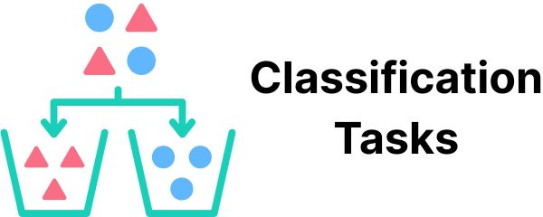
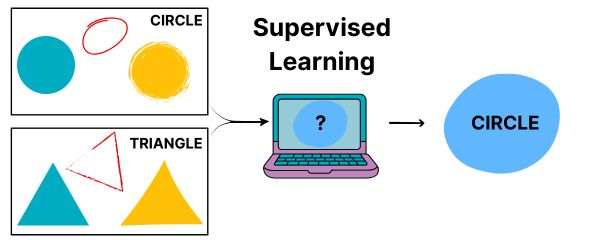

# Using Supervised Learning

This page describes the results of a project training supervised learning models to scale up the [CDC Clear Communication Index](https://www.cdc.gov/ccindex/index.html). It shows how this technique can help us assess health communication at scale. But it also shows this technique’s limits. It takes a lot of work to figure out what tasks it will be good at. And you still have to decide how good is good enough, given the labor and costs required.

## Background

### What is supervised learning?
“Supervised learning” is when you use labeled data and an algorithm to predict labels on new data. You might also hear this referred to as “[supervised machine learning](https://pmc.ncbi.nlm.nih.gov/articles/PMC7431677/)”. 

### What kinds of tasks can someone do through supervised learning?

Supervised learning is good for “[classification tasks](https://www.sciencedirect.com/topics/computer-science/classification-task)”, where you want to sort things into groups.

\

Questions with “Yes” or “No” answers are a common type of classification task. Example: you might want to know whether Tweets have a call to action. You can label Tweets with “Yes” or “No” labels yourself. Then, you can use them to train a model to predict the labels on new Tweets.

### How might supervised learning support health literacy?

In the example above, we wanted to know whether Tweets had a call to action. This is one of the questions from the CDC Clear Communication Index. We could use supervised learning to create models to answer all of the other questions from the Index too. This could help make software that could automatically give us the results of a health literacy assessment.

### How do you train a supervised learning model?

Choose a dataset that is similar to what you want to apply your model to in the future. Then label it by hand. Then run the labeled data through your chosen algorithm.

\

In our case, we used 1900 Tweets from US state public health agencies. Then 1 of 2 expert raters assigned “Yes” or “No” labels to them based on questions from the CDC Clear Communication Index. Each Index label was its own task that got its own model. For each task, we ran the labeled data through an algorithm. The result was a trained model that could predict labels on that item for new Tweets.

### How do you know if a supervised learning model is good enough?

You label a fresh dataset. Then you have the model label it too. Calculate a [performance metric](https://pmc.ncbi.nlm.nih.gov/articles/PMC8993826/) that describes how well the models’ labels match yours. Keep in mind: "good enough" isn't just about scores. Weigh the real-world costs of wrong labels. Weigh the effort of testing the model over time.

In our case, 2 expert raters applied questions from the CDC Clear Communication Index to 300 pandemic Tweets from US state public health agencies. A 3rd rater resolved conflicts to make gold-standard labels. We then had the models label the Tweets too. We used [AUC](https://pmc.ncbi.nlm.nih.gov/articles/PMC10664195/) as our performance metric. We liked that it captures info about true "Yes" labels and true "No" labels.

## Research Findings

### Do some types of models perform better than others?

**Yes, but it depends on the task at hand.** We trained 2 different kinds of models to label Tweets based on 6 items from the CDC Clear Communication Index. We created [Lasso regression](https://python.plainenglish.io/lasso-and-ridge-regression-clearly-explain-2ef7f48d01c2) models, which used word counts to predict labels. We also fine-tuned [BERT](https://huggingface.co/blog/bert-101) to create models that used neural networks to predict labels based on how words appear in context.

We found BERT models had a higher AUC than Lasso regression models on all 6 tasks. But choosing between the two wouldn’t always be so easy. Example: we observed the largest difference between both approaches when labeling Tweets as either using active voice or not. This difference is likely big enough to rule out the Lasso regression model. (But this doesn’t mean that the BERT model performs well enough for real-world use.)

```{r data01, echo=FALSE, fig.alt = "Bar chart titled: Model Performance on 'Risk Info' Task. The BERT model had an AUC value of 0.91. The Lasso regression model had an AUC value of 0.75", fig.cap="The difference between both models' performance was the biggest we observed."}
# Load library
library(ggplot2)

# Recreate our study findings
auc_data <- data.frame(
  Model = c("BERT", "Lasso"),
  AUC = c(0.91, 0.75)
)

# Create the barplot
ggplot(auc_data, aes(x = Model, y = AUC)) +
  geom_bar(stat = "identity", fill = "black", width = 0.6, show.legend = FALSE) +
  geom_label(aes(label = AUC), vjust = 1.5, size = 5, fill = "white", color = "black", label.size = 0) +
  scale_y_continuous(limits = c(0, 1), expand = expansion(mult = c(0, 0.05))) +
  labs(
    title = "Model Performance on 'Active Voice' Task",
    x = "Model",
    y = "AUC"
  ) +
  theme_minimal(base_size = 14)
```

In contrast, we observed the smallest difference between both approaches when labeling Tweets as either having info about risk or not. This difference is likely small enough that other factors like model explainability would help you choose between the two.
```{r data02, echo=FALSE, fig.alt = "Bar chart titled: Model Performance on 'Risk Info' Task. The BERT model had an AUC value of 0.91. The Lasso regression model had an AUC value of 0.75", fig.cap="The difference between both models' performance was much smaller here. And both performed pretty well."}
# Load library
library(ggplot2)

# Recreate our study findings
auc_data <- data.frame(
  Model = c("BERT", "Lasso"),
  AUC = c(0.91, 0.89)
)

# Create the barplot
ggplot(auc_data, aes(x = Model, y = AUC)) +
  geom_bar(stat = "identity", fill = "black", width = 0.6, show.legend = FALSE) +
  geom_label(aes(label = AUC), vjust = 1.5, size = 5, fill = "white", color = "black", label.size = 0) +
  scale_y_continuous(limits = c(0, 1), expand = expansion(mult = c(0, 0.05))) +
  labs(
    title = "Model Performance on 'Risk Info' Task",
    x = "Model",
    y = "AUC"
  ) +
  theme_minimal(base_size = 14)
```

### Are some tasks better suited to supervised learning?

**Yes. One way to think about this is in terms of performance metrics.** Example: we observed the lowest AUC for both approaches when labeling Tweets as using common words or not. In contrast, we observed some of the highest AUC values when labeling tweets as having a call to action or not.

**You can also think in terms of inter-rater agreement.** We used kappa to assess agreement between our raters as we created gold-standard labels. We saw low agreement on the “common words” task. Thus this task was not a good fit for either type of model, because our own raters couldn't quite agree on what the label meant. In contrast, the “call to action” item had the highest agreement. Thus this task is a better fit for supervised learning.
```{r data03, echo=FALSE, fig.alt = "Bar chart titled: Inter-rater Agreement on CDC Index Tasks. The Call to Action task had a kappa value of 0.78. The Common Words model had a kappa value of 0.26", fig.cap="Inter-rater agreement on the 'Call to Action' task met a standard benchmark of kappa=0.7. The 'Common Words' task was far below this benchmark"}
# Load library
library(ggplot2)

# Recreate our study findings
kappa_data <- data.frame(
  Model = c("Call to Action", "Common Words"),
  Kappa = c(0.78, 0.26)
)

# Create the barplot
ggplot(kappa_data, aes(x = Model, y = Kappa)) +
  geom_bar(stat = "identity", fill = "black", width = 0.6, show.legend = FALSE) +
  geom_label(aes(label = Kappa), vjust = 1.5, size = 5, fill = "white", color = "black", label.size = 0) +
  scale_y_continuous(limits = c(0, 1), expand = expansion(mult = c(0, 0.05))) +
  labs(
    title = "Inter-rater Agreement on CDC Index Tasks",
    x = "Model",
    y = "Kappa"
  ) +
  theme_minimal(base_size = 14)
```

### Are some messages better suited to supervised learning?

**Yes. To figure this out, we compared 2 groups of Tweets.** One group received correct labels across all tasks from all models. The other group received at least 2 incorrect labels across all tasks and all models.

One type of Tweet that all models performed well on was a COVID case count update. This mirrors what the expert raters observed while they labeled data themselves. This type of Tweet was common enough that they could create their own rules about how to label them. Here is an example:

> COVID-19 case summary for Colorado (Nov 5).
>
> * 121,006 cases
> * 1,287,081 people tested
> * 1,350 outbreaks
> * 2,353 deaths among cases
> * 2,153 deaths due to COVID-19

One type of Tweet that models performed poorly on was a “current events” Tweet. Here is an example:

> This year it is important to have Thanksgiving meals with only those who live within your household to limit the spread of COVID-19. Utilizing virtual communications is one way to still feel connected to those you are thankful for.

This seems to reflect the fact that these kinds of Tweets used words that most other labeled Tweets did not. This reflects a weakness of supervised learning. It might work best for messages you could template because they are so common. As such, your time might be better spent making and sharing templates rather than training models.

## Recommendations

###  For research 
Supervised learning can help scale up health literacy research. But it’s hard to know ahead of time where it will be useful. So, **create some gold-standard labels like we did.** Find out which tasks already have high inter-rater agreement. This way, you can focus on training models that output labels you can interpret.

### For practice

**Label short messages by hand.** Our research process shows you might not even need supervised learning models if your messages are short. Each of our raters worked 5 hours per week to label over 1,000 Tweets in just under 3 months. This total number made sense when we were looking at all US state health agencies. For just one organization, you can label far fewer to gain similar insights.

### For policy

**Don’t make decisions based on performance metrics alone.** Yes, we looked at performance metrics to figure out which models were more suited to our tasks. But we also looked at inter-rater agreement to figure out which tasks were suited to modeling. We looked at individual Tweets to figure out which kinds of messages were suited to this approach. These insights are more valuable together than they are alone.


