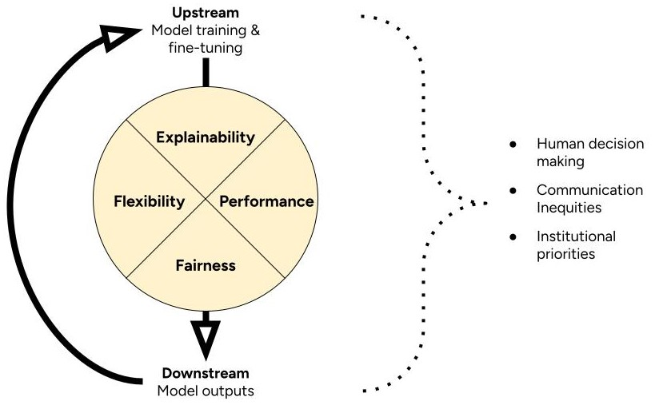

# 4-Factor Framework to Assess AI

When we judge whether a tool is suitable for a public health job, we look beyond the numbers. We ask how it works. What does it need to keep running? Does it help close health equity gaps? How fast can we tell if something goes wrong? And what does it take to get it back on track?

This is already complex. And AI adds even more steps to this process. We expect to update a typical AI tool over time. We expect it to change as real-world data change. This means we can't just judge whether an AI tool is suitable once. We need to keep assessing it over time. To help account for this, we introduce the 4-Factor Framework to Assess AI for Health Communication.

\

The 4-Factor Framework defines suitability in terms of explainability, flexibility, performance, and fairness. It prompts you to think about how these factors might change through cycles of model training and implementation. It prompts you to consider how a broader context of inequities, human decisions, and institutional priorities shape this cycle.

## Explainability

Some models are easier to explain than others. Judging this requires knowledge of the model's structure. Example: [Lasso regression](https://python.plainenglish.io/lasso-and-ridge-regression-clearly-explain-2ef7f48d01c2) uses variables with clearly defined relationships to the outputs. So, you can explain how the whole model works. But [fine-tuned BERT models](https://huggingface.co/blog/bert-101) are black boxes. They rely on complex patterns of words in context. You can start to [explain single outputs](https://christophm.github.io/interpretable-ml-book/lime.html). But not the whole model.

Some tasks are easier to explain than others too. Judging this requires access to model training and validation data. Example: inter-rater agreement was low on the task the model was trained to perform. This model would be hard to explain because humans couldn't agree on what the task meant to begin with.

[Learn more about model explainability](https://ieeexplore.ieee.org/document/8631448).

## Flexibility

Some models can adapt to more complex patterns than others. Judging this requires knowledge of how a model works. Example: regression models have rigid structures that require strict assumptions about training data. In contrast, fine-tuned BERT models adapt to many kinds of relationships between in training data. However, these relationships can be so complex that humans can't understand them.

[Learn more about model flexibility](https://link.springer.com/book/10.1007/978-3-031-38747-0).

## Performance

Some models do a task better than others. Judging this requires access to model validation data. Or making your own validation data set. In short, you need data with gold-standard labels. Then you can to test if the model outputs the same labels. You can use [performance metrics](https://pmc.ncbi.nlm.nih.gov/articles/PMC8993826/) to describe how often model outputs match the gold standard.

[Learn more about model performance](https://doi.org/10.1609/aaai.v33i01.33019808).

## Fairness

Some models might work better in certain contexts than others. Judging this might require making new validation datasets. Example: a model that identifies Tweets with calls to action. To judge its fairness, you might create a validation dataset of Tweets from health agencies with lower budgets. Does the model perform as well on those Tweets as does in other contexts?

You might also judge model fairness by exploring model training and validation data. How well do those datasets match the communities you're interested in?

[Learn more about model fairness](https://doi.org/10.1145/3194770.3194776).

## Cycles

The 4-Factor Framework asks you to think about the broader context. And its interactions with your cycles of model training and implementation. Here are some questions to help you get started.

### Human decisions

* Who trained the models? What was their background? Why did they do it?
* Who decides whether a model is suitable? Why are they in this position?
* Where did the training data come from? Who collected it? For what purpose?
* Did model training require labeled data? Who labeled it? What was their background?
* Who is responsible for the models over time? Why are they in this position?

### Communication inequities

* Who do model training datasets include? Who's missing?
* Who do we expect the model to serve?
* How well do model developers represent the communities you want to reach? What about model evaluators? What about the users of AI tools?

### Institutional priorities

* Where did people work or study while they trained the models?
* Who benefits from a model performing well? How?
* What was the goal of training models?
