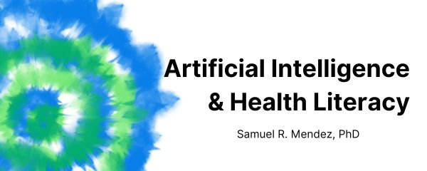

--- 
title: "Artificial Intelligence & Health Literacy: Opportunities and Challenges"
author: "Samuel R. Mendez"
date: "`r Sys.Date()`"
site: bookdown::bookdown_site
url: 'https\://health-literacy.ai'
sharing:
      facebook: false
      github: true
      twitter: false
      linkedin: true
      weibo: false
      instapaper: false
      vk: false
      whatsapp: false
cover-image: "img/cover.png"
favicon: "favicon.png"
description: "How can artificial intelligence improve health literacy? Learn about AI in public health, organizational health literacy, and why narrow, well-tested applications matter. This site shares key lessons from Samuel Mendez’s Harvard dissertation on using AI to support clear, equitable health communication."
bookdown::gitbook:
  toc:
    collapse: section
---
# Overview

\

Hi! I'm Samuel Mendez. I just got my PhD from the [Department of Social and Behavioral Sciences](https://hsph.harvard.edu/department/social-behavioral-sciences/) at Harvard's School of Public Health. I studied how we might use artificial intelligence (AI) to make health communication clearer. This site shares some lessons learned from my dissertation research. More detailed info will come in published journal articles. But in the mean time, I hope you find this site useful!

## Calls to Action

In public health, we're facing a chronic lack of funding, mass layoffs, and budget cuts. At the same time, we're facing risks like measles, bird flu, and COVID. Clear communication is more important now than ever before. And AI promises to help.

To be clear, you *can* use AI to try to address communication problems. But it’s hard to know which problems it will actually solve. And it's even harder to predict the effects of model updates. That means you’ll need to put in more work to review and test AI outputs. And it still won’t fix root issues like a lack of public trust or political support.

If you're working in health communication and planning to use AI:

* Apply AI to narrow tasks that you can track over time.
* Hire health literacy experts to review AI outputs.
* Weigh the long-term benefits of investing limited funds in community health workers instead.

## Key Terms

### What is Health Literacy?

"Health literacy" involves more than just people's reading skills. As [Healthy People 2030](https://odphp.health.gov/healthypeople/priority-areas/health-literacy-healthy-people-2030) defines it, there are 2 facets of health literacy:

  * **Personal health literacy**: how well people can find and use health info.
  * **Organizational health literacy**: how well health organizations provide people with findable, usable health info.
  
Assessing health communication is one way to assess organizational health literacy. Beyond reading grade levels, you can use more robust tools like the [CDC Clear Communication Index](https://www.cdc.gov/ccindex/index.html).

### What is AI?

"AI" is a moving target. Tech like spam filters, autofill, and navigation apps are examples of everyday AI in action. But they aren't what the term "AI" brings to mind these days. Melanie Mitchell covers this history of shifting definitions in her book *[Artificial Intelligence: A Guide for Thinking Humans](https://melaniemitchell.me/aibook/)*. In this project, I adapt her description of the practical goals of "AI" as a field:

  * **Artificial Intelligence**: computer programs meant to perform tasks we normally expect people to do

This definition also shows why "AI" is a moving target. We can get used to computers doing certain tasks. Then, after a while, we won't expect people to do them. For example: finding the quickest route to a new restaurant.
